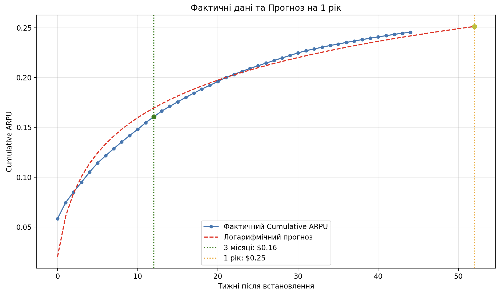

# Cohort Analysis & ARPU Forecasting

## 📌 Project Overview
This project analyzes the revenue performance of a mobile application monetized through in-app purchases. By utilizing cohort analysis on historical installation and revenue data, the script calculates current revenue metrics and builds a logarithmic forecasting model to predict future earnings.

## 🎯 Task Description
The goal is to analyze data from `Installs` and `Revenue Cohort` datasets to calculate the following metrics:
1. **3-Month ARPU:** How much the company earns per user 3 months (12 weeks) after the app installation.
2. **1-Year ARPU Forecast:** How much the company is projected to earn per user 1 year (52 weeks) after installation.

## ⚙️ Technologies Used
* **Python** 
* **Pandas & NumPy:** Data manipulation and calculation
* **SciPy (`curve_fit`):** Logarithmic trend modeling
* **Matplotlib:** Data visualization

## 📊 Results & Conclusions

**1. Revenue per user for 3 months: $0.16**  
At the 12-week mark (approximately 3 months), the cumulative ARPU is $0.16. This means that during the first three months of using the application, the company earns an average of 16 cents from each new installation.

**2. Projected revenue per user for 1 year: $0.25**  
Since the actual data only covers 44 weeks, logarithmic forecasting was used to estimate the revenue for a full year (52 weeks). According to the trend, the expected revenue per user for the year will reach $0.25.

### 📈 ARPU Forecast Visualization
*Here you can see the actual data plotted against our logarithmic forecast model:*

**Key Insights:**
* **Logarithmic Growth:** Revenue growth has a pronounced logarithmic character. This is a classic behavioral pattern for mobile apps: the fastest revenue accumulation occurs in the first few weeks after installation when users are most active and engaged.
* **Churn & Flattening:** Over time, the curve flattens. Revenue continues to grow, but at a significantly slower pace as a portion of users stops using the product (churn), and the remaining users make purchases less frequently.
* **Business Application:** By knowing the ARPU at the 3-month and 1-year marks, the company can compare these figures against their Customer Acquisition Cost (CAC). This helps determine the exact week when marketing expenses break even and the application begins generating net profit.
